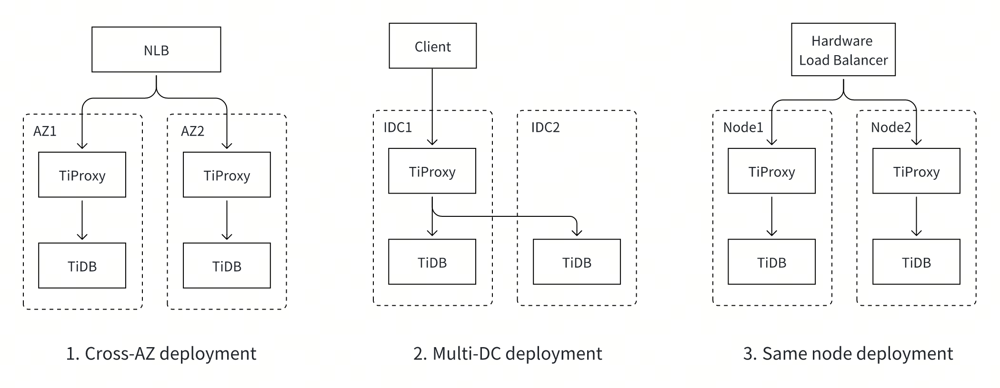
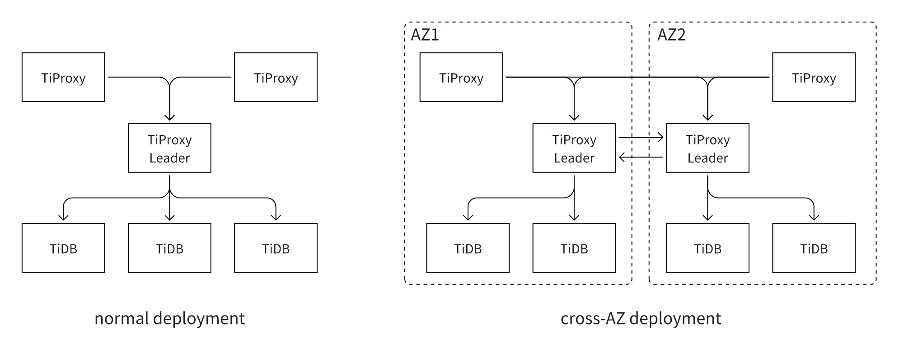

# Proposal: Multi-Factor-Based Balance

- Author(s): [djshow832](https://github.com/djshow832)
- Tracking Issue: https://github.com/pingcap/tiproxy/issues/465

## Abstract

This proposes a design of balancing TiDB instances based on multiple factors to maximize resource usage and reduce costs.

## Terms

- Session/connection migration: TiProxy migrates a backend connection from one TiDB to another while preserving the client connection.
- AZ: Available Zone
- IDC: Internet Data Center
- OOM: Out Of Memory

## Background

Currently, TiProxy routes and balances connections based on SQL port, HTTP status, and connection counts of TiDB instances. However, it may be inefficient:
- TiProxy may be unable to serve queries but the SQL and HTTP ports are still available.
- When a runaway query makes a TiDB OOM, all the connections on the TiDB are disconnected. Actually, connections without runaway queries have a chance to be migrated away before the TiDB fails.
- In multi-AZ deployment, the cross-AZ traffic between TiProxy and TiDB may lead to significant fees. It's more cost-effective for TiProxy to route to the local TiDB preferentially.
- The workload of each connection may be different: some may be busy while others may be idle. We have seen cases when connection counts are balanced while CPU usage is not.

Therefore, TiProxy should consider more factors, and here come the challenges:
- We need to consider multiple factors together. For instance, when the CPU usage of one TiDB is higher while the memory usage of another TiDB is higher, how does TiProxy balance them?
- How to balance TiDB in time while avoiding thrash?

## Goals

- TiProxy tries its best to avoid connection failure, reduce query latency, and save costs.
- TiProxy does not waste too many resources migrating connections. That is, the load balance should not thrash.
- The configurations should be easy to use. TiProxy should work efficiently without requiring users to know too many details.

## Non-Goals

- TiProxy is irresponsible for preventing TiDB from being unhealthy. For example, TiProxy doesn't prevent TiDB from OOM through connection migration.
- TiProxy doesn't need to keep all the connections all the time. For example, if one long query causes OOM, TiProxy doesn't need to recover that connection or retry that query.

## Proposal

### Priority of Factors

The goals can be ordered by importance:
1. Zero downtime. If a critical failure makes TiDB keep reporting errors, this situation is equivalent to unavailability.
2. Avoid connection failure, which may be caused by TiDB OOM.
3. Reduce query latency. TiProxy should keep TiDB load-balanced to make full use of TiDB resources.
4. Save costs. Cross-AZ traffic should be minimized.

Thus, I propose to sort the factors by priority. More specifically, the factors are considered in this order:
1. Status and health
2. Memory
3. CPU usage
4. Location, including AZ
5. Connection counts

### Factors

#### Status

Status means whether the TiDB is serving and undoubtedly deserves the highest priority. Currently, TiProxy checks TiDB status by these means:
- Connect to the SQL port and read the initial handshake packet. If it fails, TiDB may be down, too busy, encountering a network partition, initializing statistics, or disconnecting to PD.
- Read the status through the HTTP API `/status`. If it fails, TiDB may be about to shut down.

#### Health

Status is not enough: there exist cases where TiDB accepts connections but can't serve queries, so we add more checks:
- Check the metric `tidb_tikvclient_backoff_seconds_count{type="pdRPC"}`, which increases when TiDB can't connect to PD to fetch the latest schema version
- Check the metric `tidb_tikvclient_backoff_seconds_count{type=~"regionMiss|tikvRPC"}`, which increases when TiDB can't connect to TiKV instances

There are some more metrics to check, such as execution error counts and handshake error counts. The problem is that if all the connections are migrated away, TiProxy should still know when TiDB recovers. For example, `tidb_server_execute_error_total` no longer increases when the TiDB has no queries, even if it doesn't recover. Thus, TiProxy shouldn't check these kinds of metrics.

#### Memory

Although the memory management is optimized, TiDB still suffers from OOM and it's hard to resolve it completely soon. Given that, TiProxy should migrate as many connections as possible away from the TiDB with an OOM risk.

It should be underscored that:
- TiProxy is irresponsible for preventing TiDB from OOM. Although TiProxy can relieve memory pressure by migrating connections away, it does little to help. Typically, OOM is caused by only a few runaway queries while the other connections contribute little to memory. The runaway queries last until OOM and can't be migrated away. Our goal is to rescue innocent connections.
- It's unnecessary to balance memory all the time. Imagine the situation where the memory usages of 2 TiDB instances are stable at 20% and 50% respectively. This imbalance doesn't affect the queries. If TiProxy still balances memory in this case, the latter factors, such as CPU usage, may never be balanced. Thus, TiProxy only focuses on OOM.

These cases are considered as OOM risks:
- Memory increases so sharply that it's going OOM within 45 seconds. TiProxy compares the recent memory usage history and estimates the remaining time to OOM.
- Memory usage is above 80%, in which case even a memory jitter may cause OOM.

#### CPU Usage

Similarly to memory-based balance, TiProxy doesn't need to balance CPU usage all the time. The query latency differs little when the CPU usage is 20% or 30%, so TiProxy only needs to consider the situation when a TiDB is too busy to serve queries while another is relatively idle. This gives a chance to reduce cross-AZ costs more efficiently.

Consider the following situation: there are 2 TiProxy instances and 3 TiDB instances in a 3 AZ deployment. Suppose that the queries to TiProxy themselves are imbalanced, the routing rules should be as follows:
- When CPU usages of local and remote TiDB are close, TiProxy routes directly to the local TiDB.
- If the local TiDB becomes busier than the remote one, TiProxy migrates some connections to the remote TiDB.
- If the local TiDB fails, TiProxy routes to remote TiDB to keep availability.
- When the local TiDB recovers or becomes idler, TiProxy migrates connections back to it.

#### Location

There are some cases where location affects the cluster:
- The cluster is deployed across multiple AZs on the cloud. TiProxy should preferentially route to the local TiDB to reduce the cross-AZ cost.
- The cluster is deployed across IDCs. TiProxy should preferentially route to the local TiDB to reduce network hops across data centers.
- TiProxy is deployed on the same node as TiDB. TiProxy should preferentially route to the local TiDB to reduce network hops.

Just like the follower reads in TiDB, TiProxy can recognize location by labeling TiProxy and TiDB instances.

#### Connection Counts

Connection counts only work when all the above factors are balanced. Imagine the situation when a TiDB cluster starts and the client fires hundreds of connections all at once. The CPU usage and memory on all TiDB instances are low at startup. TiProxy can route connections based on connection count to make the initial load balanced.

### Factor Collection

In terms of memory usage, CPU usage, and health-related metrics, there are 2 ways to collect the metrics:
- TiProxy collects them through the TiDB HTTP API `/metrics`. This is expensive when the cluster is big because TiDB returns around 1MB of data to each TiProxy and each TiProxy parses the data of all TiDB.
- TiProxy reads from Prometheus. The refresh interval of Prometheus is 15 seconds, which may be a little long. More importantly, TiProxy can not read from Prometheus on the Cloud because Prometheus is deployed in another VPC.

We decide to choose both. TiProxy reads from Prometheus when Prometheus is available and reads from TiDB when it's not. This takes both performance and availability into account.

As for the performance when the cluster is big, we use a centralized topology. The TiProxy leader reads from TiDB, and other TiProxy members read from the leader. Although the pressure of the TiProxy leader is not relieved, the performance of TiDB is nearly unaffected.

In a big cluster on the cloud, cross-AZ traffic also matters. A zonal leader is elected in each zone. The zonal leaders read TiDB in the same zone and each TiProxy reads from all the zonal leaders. The aggregated data from the leaders is trivial, so the cross-AZ traffic is not much.

### Avoid Thrash

A big challenge of multi-factor balance is to avoid thrash. A thrash means connections keep migrating back and forth between 2 TiDB instances. The thrash may be caused by one factor or multiple factors.

Assuming the CPU usage of TiDB A and B are 50% and 55% respectively. If the 2 instances are considered imbalanced, connections may be migrated from B to A. However, the CPU usage of A may be higher in the next round because:
- The CPU usage jitters. The CPU usage can be smoothed using the EWMA algorithm.
- After some connections are migrated, the load of A becomes higher. We can increase the threshold of imbalance. For example, only rebalances when the CPU usage difference is over 20%. Rebalancing should be more sensitive in a high load, so the threshold should be self-adaptive.
- The collected CPU usage delays when migration is ongoing. TiProxy should migrate slowly when it's not urgent so that TiProxy has more accurate CPU usage as its feedback.

Let's now consider the thrash caused by multiple factors. Assuming the memory usage of TiDB A is much higher than TiDB B and then TiProxy migrates connections from B to A until the memory gap is narrowed below the threshold. Then the CPU usage of A becomes much higher and TiProxy migrates connections back to B. The result is that the connections are migrated back and forth.

TiProxy scores each factor and orders the TiDB instances by the scores. It migrates connections only when a factor is imbalanced and the score order of this factor is the same as the overall score order. Take 3 factors and 2 TiDB instances for example, the scores and imbalance thresholds for factors are as follows:

|| Factor 1 | Factor 2 | Factor 3 |
|-|-|-|-|
| TiDB A | 2 | 1 | 2 |
| TiDB B | 1 | 2 | 1 |
| Threshold | 2 | 1 | 1 |

We order the instances by the overall scores. Since factor 1 of TiDB A has a higher score, TiDB A scores higher than TiDB B, that is, TiDB A is considered to have a higher load than B.
1. For factor 1, the difference of 2 instances is 1 and is less than the threshold, so it's balanced.
2. We continue with factor 2. The difference is equal to the threshold, but since B has an overall lower load than A, we can't migrate connections to A, otherwise, it may cause factor 1 to be unbalanced.
3. As for factor 3, it's unbalanced and TiDB A has a higher score. Since the overall score of A is also higher, we can migrate connections to B. Although it conflicts with factor 2, it helps to ease the imbalance of factor 1.

### Migration Speed Control

Each factor should have its own migration speed. For example, the status-based balance should migrate connections fast because the source TiDB is going down, but the CPU-based balance is different. 

Assuming only a few connections are busy, fast migration may happen to migrate most of the busy connections to the target TiDB, which leads to thrash. Besides, the collected CPU usage delays when migration is ongoing.

Thus, the status-based, health-based, and memory-based balance should migrate connections fast but the others should migrate slowly.

### Configurations

We only expose important configurations to users to improve the experience.

Only these factor combinations are available:
- Resource: the order is status > health > memory > CPU > location > connection. This is the default one.
- Location: the order is status > location > health > memory > CPU > connection. This is reserved for the case where the cluster is large and the cross-AZ traffic is very high.
- Connection: the order is status > connection.

### Observability

These metrics are crucial for troubleshooting and will be exposed in Grafana:
- The imbalanced factor that a connection migration is based on
- Cross-AZ traffic

Users may set the log level to error to reduce disk usage. This information should be exposed from system tables and TiProxy HTTP API:
- The value of each indicator of each TiDB from the view of each TiProxy
- The balance event information of each session migration

## Alternative Proposals

### Connection Multiplex

Typical L7 SQL proxies are capable of connection multiplexing, which allows multiple frontend connections to reuse the same backend connection. As long as the sessions are stateless, user queries can be sent to any of the backends. This is more like a transaction-level load balance, which can also work well. I give up this solution because:
- Stateful sessions can not reuse backend connections, but they are common.
- The session states must be updated after every statement, which requires a lot of work.

### Score-Based Balance

It's also straightforward to assign each factor a weight and calculate the overall score for each backend. TiProxy can simply balance by scores. Flexible though it may look, it's not easy to use:
- It's hard for users to tune weights. The value of weights is meaningless, requiring users to try again and again.
- It's hard to find the reasons for connection migrations because the score is calculated by multiple factors.

### CPS-Based Balance

There are some indicators for the load of TiDB: CPU usage, CPS or QPS, average query latency, and more. The rationale behind choosing CPU usage is that the other indicators may not work well in the real world. For example:
- The workload on each connection differs. A large query may make a TiDB instance busy and thus decrease the CPS.
- TiDB load may be affected by not only user queries but also background jobs and Go runtime GC.

Moreover, we need to distinguish high loads through CPU usage, which helps:
- As explained earlier, TiProxy only needs to balance the load when TiDB is busy.
- In the future, TiProxy can throttle requests when all TiDB instances are busy.

## Future Work

### Request Throttling

Now that TiProxy has information about the memory and CPU usage of each TiDB, it can throttle requests when no TiDB is capable of processing requests. Specifically, TiProxy holds requests for some time before sending them to TiDB. The rationale is that the QPS becomes even lower as concurrency increases when TiDB CPU usage is full, so throttling requests is more efficient.
