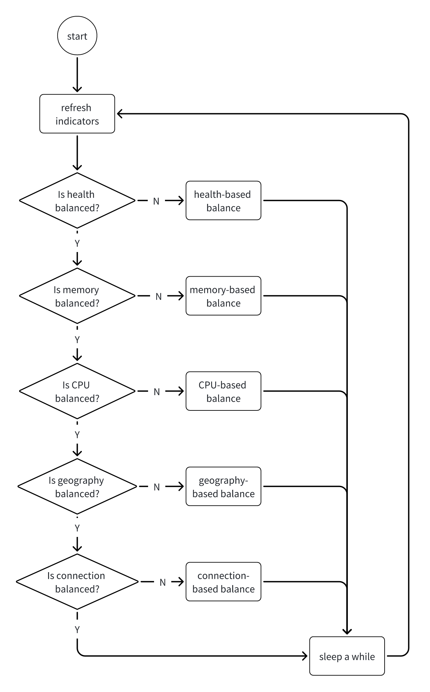
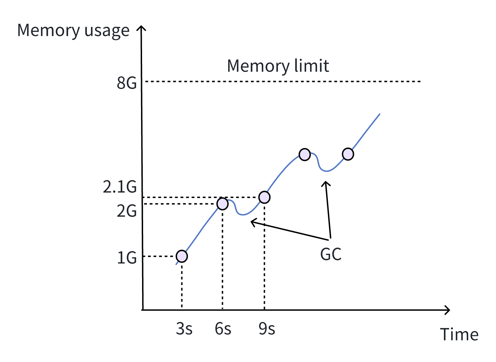
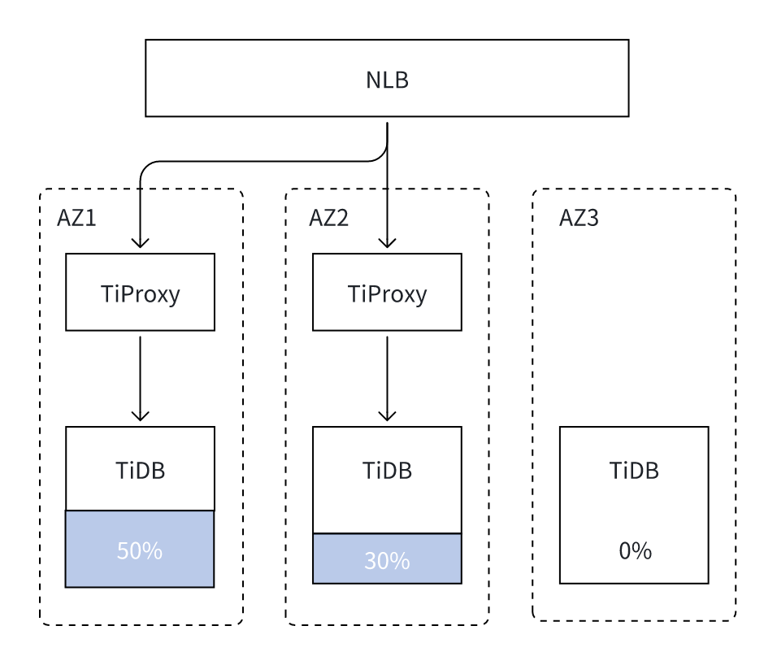
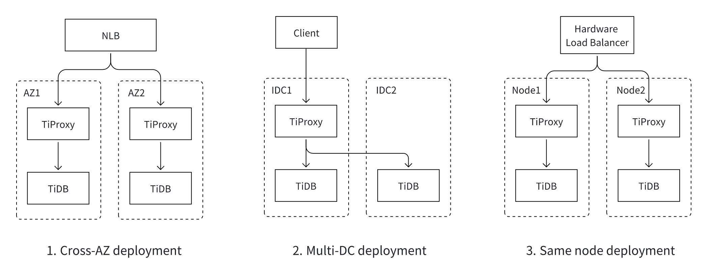

# Proposal: Multi-Factor-Based Balance

- Author(s): [djshow832](https://github.com/djshow832)
- Tracking Issue: https://github.com/pingcap/tiproxy/issues/465

## Abstract

This proposes a design of balancing TiDB instances based on multiple factors to maximize resource usage and reduce costs.

## Terms

- Session/connection migration: TiProxy migrates a backend connection from one TiDB to another while preserving the client connection.
- AZ: Available Zone
- IDC: Internet Data Center

## Background

Currently, TiProxy balances connections based on health and connection counts of TiDB instances. Specifically, it balances TiDB in 2 ways:
- TiProxy routes a new connection to the healthy TiDB instance with the least connection count
- TiProxy migrates connections when the connection count on a TiDB instance is much higher than others or when the TiDB is unhealthy

However, it may be inefficient to merely balance based on health and connection counts:
- The workload of each connection may be different: some may be busy while others may be idle. We have seen cases when connection counts are balanced while CPU usage is not.
- When some big queries make a TiDB OOM, all the connections on the TiDB are disconnected. Actually, connections without big queries have a chance to be migrated away before the TiDB fails.
- In multi-AZ deployment, the cross-AZ traffic between TiProxy and TiDB may lead to significant fees. It's more cost-effective for TiProxy to route to the local TiDB preferentially.

Therefore, TiProxy should consider more factors, and here come the challenges:
- We need to consider multiple factors together. For instance, when the CPU usage of one TiDB is higher while the memory usage of another TiDB is higher, how does TiProxy balance them?
- How to balance TiDB in time while avoiding thrash?

## Goals

- TiProxy tries its best to avoid connection failure, reduce query latency, and save costs.
- TiProxy does not waste too many resources migrating connections. That is, the load balance should not thrash.
- The configurations should be easy to use. TiProxy should work efficiently without requiring users to know too many details.

## Non-Goals

- TiProxy is irresponsible for preventing TiDB from being unhealthy. For example, TiProxy doesn't prevent TiDB from OOM through connection migration.
- TiProxy doesn't need to keep all the connections all the time. For example, if one long query causes OOM, TiProxy doesn't need to recover that connection or retry that query.

## Proposal

### Priority of Factors

The goals can be ordered by importance:
1. Zero downtime. If a critical failure makes TiDB keep reporting errors, this situation is equivalent to unavailability.
2. Avoid connection failure, which may be caused by TiDB OOM.
3. Reduce query latency. TiProxy should keep TiDB load-balanced to make full use of TiDB resources.
4. Save costs. Cross-AZ traffic should be minimized.

Thus, I propose to sort the factors by priority. More specifically, the factors are considered in this order:
1. Health
2. Memory
3. CPU usage
4. Geography, including AZ
5. Connection counts



### Factors

#### Health

Health undoubtedly deserves the highest priority. Currently, TiProxy checks TiDB health by these means:
- Connect to the SQL port. If it fails, TiDB may be down, be too busy, exceed `max_connections`, or encounter a network partition.
- Read the status through the HTTP status port. If it fails, TiDB may be about to shut down.

This is not enough: there exist cases where TiDB accepts connections but can't serve queries. For example:
- TiDB can't connect to PD to fetch the latest schema version
- TiDB can't connect to the TiKV which stores the schema

TiProxy should be aware of these failures and mark the TiDB instance as unhealthy. This can be achieved by:
- TiDB returns the failure on the status port. The disadvantages are:
    - TiDB has to enumerate all the possible critical failures.
    - Only the new TiDB versions are supported since the updates are on TiDB.
- TiProxy calculates the error rate in the last few seconds for each TiDB instance. Once the error rate on one TiDB is extremely high while the others are low, TiProxy marks that TiDB instance as unhealthy. The downside is:
    - TiProxy has to keep a few connections on that TiDB to know whether it has recovered. This is more like the half-open state in a circuit breaker. Thus, errors keep being reported during the failure.

#### Memory

Although the memory management is optimized, TiDB still suffers from OOM and it's hard to resolve it completely soon. Given that, TiProxy should migrate as many connections as possible away from the TiDB that has an OOM risk.

It should be underscored that:
- TiProxy is irresponsible for preventing TiDB from OOM. Although TiProxy can relieve memory pressure by migrating connections away, it does little to help. Typically, OOM is caused by only a few long queries while the other connections contribute little to memory. The long queries last until OOM and can't be migrated away. Our goal is to rescue the innocent connections.
- It's unnecessary to balance memory all the time. Imagine the situation where the memory usages of 2 TiDB instances are stable at 20% and 50% respectively. This imbalance doesn't affect the queries anyway. If TiProxy still balances memory in this case, the latter factors, such as CPU usage, may never be balanced. Thus, TiProxy only focuses on OOM.

TiProxy periodically collects TiDB memory usage through the HTTP status port. The reason it doesn't read from Prometheus is that the refresh interval is 15s, which is too long. TiDB can add an API for querying memory usage. Alternatively, TiProxy can directly read from the API `/metrics`.

The challenge is to recognize the risk of OOM. It should be neither too conservative nor too aggressive.
- Sometimes the duration from normal memory usage to OOM is only about ten seconds. If it's too late to recognize the risk, connections are lost.
- It's normal that TiDB memory jitters within a reasonable range. If TiProxy mistakenly treats jitters as OOM risks, it will cause frequent migration, which in turn increases query latency.

These cases should be considered as OOM risks:
- Memory increases so sharply that it's going OOM within 30 seconds.
- Memory usage is above 80%, in which case even a jitter may cause OOM.

TiProxy compares the recent memory usage history and estimates the remaining time to OOM. Though this sounds simple, the real memory usage may look like this:



Suppose that the memory is collected at the 3rd, 6th, and 9th second.
1. At the 3rd second, the memory usage is 1GB and there comes a big query.
2. At the 6th second, the memory usage increases sharply to 2GB. The estimated remaining time is `(8GB - 2GB) / (2GB - 1GB) * 3s = 18s`, which means it is an OOM risk.
3. At the 9th second, the memory usage is 2.1GB. The remaining time increases to `(8GB - 2.1GB) / (2.1GB - 2GB) * 3s = 177s`. It looks like the risk is relieved and TiProxy stops migration. However, the memory decrease may be caused by a Go runtime GC rather than the end of the big query.

Thus, the risk should not be interrupted by a random GC. TiProxy only relieves the OOM risk after consecutive non-risk estimations.

TiProxy should migrate connections at some speed, depending on urgency.
- If the remaining time is short, TiProxy migrates `connection_count / (remaining_time - 15)` connections every second. It ensures that TiProxy can migrate all the connections away before TiDB is down while reserving 15s for connection migrations.
- If the memory usage is high while the remaining time is long, TiProxy migrates a few connections at a time until the memory usage is under a safe watermark.

#### CPU Usage

Similarly to memory-based balance, TiProxy doesn't need to balance CPU usage all the time. The query latency differs little when the CPU usage is 20% or 50%. That is, TiProxy only needs to consider the situation when a TiDB is too busy to serve queries while another one is relatively idle. This gives a chance to reduce cross-AZ costs more efficiently.

Consider the following situation: there are 2 TiProxy instances and 3 TiDB instances in a 3 AZ deployment. Suppose that the queries to TiProxy themselves are imbalanced, the routing rules should be as follows:
- When the local TiDB is not busy enough, as the illustration shows, TiProxy routes directly to the local TiDB.
- Once the local TiDB fails, TiProxy routes to remote TiDB to keep availability.
- Once the local TiDB becomes busy, TiProxy migrates some connections to TiDB to make full use of resources.
- When the local TiDB recovers or becomes not busy, TiProxy migrates some connections back to it.



TiProxy collects TiDB CPU usage periodically, together with memory. Unpredictable workload may cause CPU usage to jitter and make it harder to recognize the real high load. Fortunately, load-based balance does not need to be as timely as memory-based balance. TiProxy can make a cautious decision according to CPU usage during the last few minutes.

The EWMA algorithm can be introduced to eliminate jitters:

```
CPU_usage[t] = CPU_usage[t-1] * factor + current_CPU_usage * (1 - factor)
```

TiProxy balances the load in an iterative fashion. It migrates a few connections every time and then waits for the next collection until the loads are balanced.

#### Geography

There are some cases where geographical topology affects the cluster:
- The cluster is deployed across multiple AZs on the cloud. TiProxy should preferentially route to the local TiDB to reduce the cross-AZ cost.
- The cluster is deployed across IDCs. TiProxy should preferentially route to the local TiDB to reduce network hops across data centers.
- TiProxy is deployed on the same node as TiDB. TiProxy should preferentially route to the local TiDB to reduce network hops.



For all the above cases, users can mark geography by labeling TiProxy and TiDB instances. For the 2nd and 3rd cases, TiProxy can also recognize geography internally according to the ping latency between TiProxy and TiDB. As for the 1st case, however, it proves that ping latency does not always conform to geography. Practices show that ping latency is unstable, making same-AZ latency sometimes even higher than cross-AZ latency.

#### Connection Counts

Connection counts only work when all the above factors are balanced. Imagine the situation when a TiDB cluster starts and the client fires hundreds of connections all at once. The CPU usage and memory on all TiDB instances are low at startup. TiProxy can route connections based on connection count to make the initial load balanced.

### Watermark

Consider this case:
- The CPU usages of TiDB A and B are 60% and 90% respectively
- The connection counts on TiDB A and B are 100 and 200 respectively

Firstly, TiProxy migrates connections from TiDB B to TiDB A until the CPU usage gap is narrowed. Then it's going to rebalance by connections. Although the connection count on TiDB B is far more than A, it can't migrate the connections back, otherwise the CPU usage will be imbalanced again.

To avoid this kind of thrash, a high and low watermark is assigned to each factor. When the imbalance of a factor exceeds the high watermark, TiProxy rebalances it until it's below the high watermark. When TiProxy rebalances the latter factors, it should not break the low watermarks of the former factors.

In the above example, suppose the high and low watermarks for CPU-based balance are set to 20% and 10% respectively. TiProxy firstly migrates connections until the CPU usage gap is below 20%, say, 18%. When balancing based on connections, it won't migrate connections back because 18% is higher than the low watermark 10%.

We need tests to figure out the best values for watermarks.

### Configurations

Many constants can be configured, but it confuses users to expose too many configurations. We'll do tests to find the best values and do not expose them until we find it necessary.

### Observability

These metrics are crucial for troubleshooting and will be exposed in Grafana:
- The value of each indicator of each TiDB from the view of each TiProxy
- The imbalanced factor that a connection migration is based on

## Alternative Proposals

### Connection Multiplex

Typical L7 SQL proxies are capable of connection multiplexing, which allows multiple frontend connections to reuse the same backend connection. As long as the sessions are stateless, user queries can be sent to any of the backends. This is more like a transaction-level load balance, which can also work well. I give up this solution because:
- Stateful sessions can not reuse backend connections, but they are common.
- The session states must be updated after every statement, which requires a lot of work.

### Score-Based Balance

It's also straightforward to assign each factor a weight and calculate the overall score for each backend. TiProxy can simply balance by scores. Flexible though it may look, it's not easy to use:
- It's hard for users to tune weights. The value of weights is meaningless, requiring users to try again and again.
- It's hard to find the reasons for connection migrations because the score is calculated by multiple factors.

### CPS-Based Balance

There are some indicators for the load of TiDB: CPU usage, CPS or QPS, average query latency, and more. The rationale behind choosing CPU usage is that the other indicators may not work well in the real world. For example:
- The workload on each connection differs. A large query may make a TiDB instance busy and thus decrease the CPS.
- TiDB load may be affected by not only user queries but also background jobs and Go runtime GC.

Moreover, we need to distinguish high loads through CPU usage, which helps:
- As explained earlier, TiProxy only needs to balance the load when TiDB is busy.
- In the future, TiProxy can throttle requests when all TiDB instances are busy.

## Future Work

### Request Throttling

Now that TiProxy has information about the memory and CPU usage of each TiDB, it can throttle requests when no TiDB is capable of processing requests. Specifically, TiProxy holds requests for some time before sending them to TiDB. The rationale is that the QPS becomes even lower as concurrency increases when TiDB CPU usage is full, so throttling requests is more efficient.

### Large Cluster Optimization

The current design works well for normal-sized clusters, but it may have a performance issue when the cluster grows large enough. For example, each TiProxy collects the indicators for each TiDB, requiring 3 requests each time. When there are 100 TiProxy and 500 TiDB instances, TiProxy sends 1500 requests and each TiDB responds to 300 requests during every health-check interval, which is a considerable overhead. This issue will be optimized in the future.
