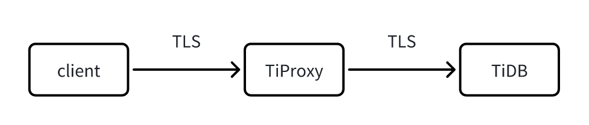

# Proposal: Certificate-Based Authentication

- Author(s): [djshow832](https://github.com/djshow832)
- Tracking Issue: https://github.com/pingcap/tiproxy/issues/464

## Abstract

This proposes a design of supporting certificate-based authentication on TiProxy.

## Background

TiDB supports certificate-based authentication. It validates the certificate requirements that are claimed by `require subject`、`require issuer`、`require san`, and `require cipher` clauses.

TiProxy supports both client-side and server-side TLS but it doesn't support cert-based authentication. Users connect to TiProxy with one certificate, but TiProxy connects to TiDB with another certificate. TiDB validates the certificate from TiProxy but not the one from the user, so the user fails to log in.

Besides, statements `SHOW STATUS` and `STATUS` currently show different results. `SHOW STATUS` shows the TLS information between TiProxy and TiDB, while `STATUS` shows the TLS information between the client and TiProxy. There even exists a case when one TLS is enabled while the other is disabled.

</img>

## Goals

- Support all of `require subject`、`require issuer`、`require san`, and `require cipher` options.
- The TLS information of `SHOW STATUS` and `STATUS` are consistent.

## Proposal

### Basic Steps

1. A signing certificate is placed on TiProxy once TiProxy is deployed. The signing certificate is the same as the one specified by `session-token-signing-cert` on TiDB.
2. When a client connects to TiProxy, TiProxy reads the subject, issuer, SAN, and cipher of the client certificate and generates a signature by the signing certificate.
3. TiProxy connects to TiDB and passes the subject, issuer, SAN, and cipher of the client certificate, together with the signature, in the connection attribute field of the handshake packet.
4. TiDB reads the data from the connection attribute. It validates the TLS information by checking the signature with the signing certificate `session-token-signing-cert`.
5. TiDB replaces the TiProxy TLS information with the information in the connection attribute. It uses new TLS information to validate certificate requirements and output to `SHOW STATUS`.

This is similar to JWT. TiProxy doesn't need to validate the certificate by itself. Instead, it uses the signing certificate to make TiDB trust itself and then passes the client certificate information to TiDB.

### Signing Certificate

The signing certificate should be exactly the same as that of TiDB. Thus, you can treat the certificate as the passport among the instances. We can do more things based on the signing certificate. The address of the certificate is defined by the same configuration as TiDB: `session-token-signing-cert` and `session-token-signing-key`.

The certificate may be renewed anytime, so TiProxy periodically reloads the certificates to avoid expiration. At the same time, TiDB should retain the old certificate for a while just in case a user logs in during the certificate renewal.

1. TiProxy reloads the signing certificate every 10 minutes and always generates the signature by the latest signing certificate.
2. TiDB also reloads the signing certificate every 10 minutes, but it retains the old one in memory for 15 minutes.
3. When a user logs in, TiDB validates the signature by the latest signing certificate first.
4. If it fails, TiDB then validates the signature by the old certificate, if the old one has expired in less than 15 minutes.

The certificate is generated manually or automatically, according to the deployment method.

- Since TiUP generates the signing certificate automatically on TiDB, it also generates it automatically on TiProxy.
- TiDB-Operator doesn't generate the signing certificate automatically and requires users to generate it.
- For manual deployment, users should generate the signing certificate manually.

### Token

Firstly, TiProxy generates a JSON-format payload, such as `{"subject": "...", "issuer": "...", "SAN": "...", "cipher": "..."}` and then generates the signature from the payload.

The key-values in the connection attribute field are as follows:

```
tiproxy-cert-info: {"subject": "...", "issuer": "...", "SAN": "...", "cipher": "..."}
tiproxy-cert-signature: ...
```

The keys are prefixed by `tiproxy-` to avoid overwriting client key-values.

TiDB removes these key-values after handshake so that users won't see them in system tables.

### Compatibility

Since it requires the code change from TiDB, it only supports TiDB v8.1 and later versions. Also, TiUP automatically generates the signing certificates on TiProxy in later versions.

## Alternative Proposals

### Validate Certificate in TiProxy

An alternative is to validate the client certificate on the TiProxy side. The client certificate requirement is stored on the TiDB side. We have some ways to obtain them.

- Configure requirements on TiProxy: We can configure the same certificate requirements on TiProxy. This requires automatic or manual operations every time a user is created, altered, or dropped to keep the certificate requirements the same as those of TiDB.
- Fetch requirements from TiDB: TiProxy fetches the certificate requirements from TiDB periodically, either from the SQL port or the HTTP port. The prerequisite is that TiDB needs to authenticate TiProxy. Caching usernames and requirements is less safe. Besides, the cached requirements have a time lag.

Both ways make TiProxy more heavy-weighted compared with using connection attributes.

### Upload Certificate to TiProxy

Every time a new kind of certificate requirement is created, a certificate with the same information should be created and placed on TiProxy. For example, when the administrator creates a user `u1` with clause `REQUIRE CIPHER "EDH-RSA-DES-CBC3-SHA"`, he should also create a certificate with cipher `EDH-RSA-DES-CBC3-SHA` and place it on TiProxy.

When `u1` connects to TiProxy, TiProxy reads the cipher `EDH-RSA-DES-CBC3-SHA` from the client certificate information and then chooses the local certificate with the same cipher to connect to TiDB. Thus, TiDB won't deny the connection.

The problem is the complexity of creating and uploading certificates, which is not easy to maintain.

### Authenticate TiProxy Based on CN

Instead of validating the signature, TiDB can also validate the CN(Common Name) of the TiProxy certificate to ensure it's trustworthy. This is similar to the cluster TLS validation in TiDB. TiDB configures an allowed CN list in `security.cluster-verify-cn` and rejects other CN.

However, this requires that the TLS between TiProxy and TiDB must be enabled, which may be not true when TiProxy and TiDB are in the same VPC.

The advantage is that it will be easier for certificate renewal. Certificates don't need to be renewed at the same time for all instances.
