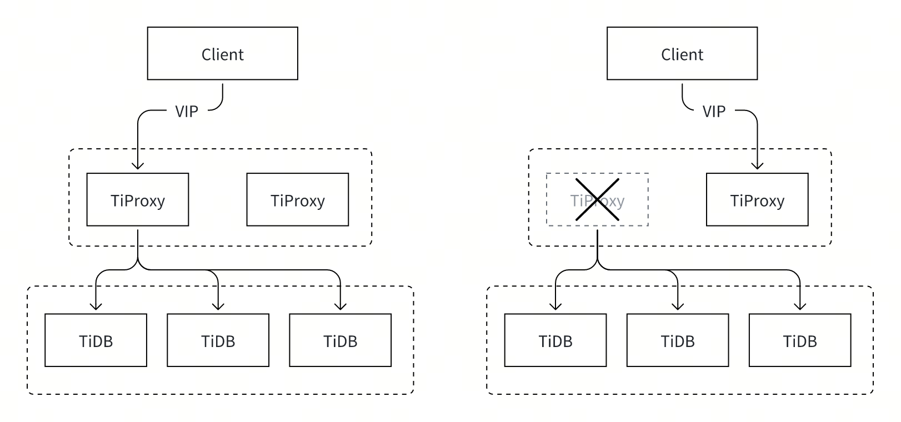

# Proposal: VIP-Management

- Author(s): [djshow832](https://github.com/djshow832)
- Tracking Issue: https://github.com/pingcap/tiproxy/issues/583

## Abstract

This proposes a design of managing VIP on TiProxy clusters to achieve high availability of TiProxy without deploying third-party tools.

## Terms

- VIP: Virtual IP
- ARP: Address Resolution Protocol
- VRRP: Virtual Router Redundancy Protocol
- MMM: Multi-Master Replication Manager for MySQL
- MHA: Master High Availability

## Background

In a self-hosted TiDB cluster with TiProxy, TiProxy is typically the endpoint for clients. To achieve high availability, users may deploy multiple TiProxy instances and only one serves requests so that the client can configure only one database address. When the active TiProxy is down, the cluster should elect another TiProxy automatically and the client doesn't need to update the database address.

So we need a VIP solution. The VIP is always bound to an available TiProxy node. When the active node is down, VIP is switched to another node.



Currently, typical solutions include:

- Deploy keepalived together with TiProxy. Keepalived is capable of both health checks and VIP management.
- Deploy a crontab job to check the health of TiProxy and set VIP

Both ways are not easy to use. This design proposes a solution to enable the TiProxy cluster to manage VIP by itself.

## Goals

- Bind a VIP to an available TiProxy node and switch the VIP when the node becomes unavailable
- Support VIP management on self-hosted TiDB clusters that run on bare metal with Linux

## Non-Goals

- Support configuring weights of TiProxy nodes
- Support configuring multiple VIPs for a TiProxy cluster
- Support VIP management on Docker, Kubernetes, or cloud
- Support VIP management on non-Linux operating systems

## Proposal

### Active Node Election

Firstly, the TiProxy cluster needs to elect an available instance to be the active node. Etcd is built in PD and is capable of leader election, so we can just use the etcd election.

When a TiProxy finds that it's chosen to be active, it binds VIP to itself. When it finds that it's no longer the leader, it unbinds the VIP.

### VIP management

Once a node is chosen to be active, it binds the VIP to itself through 2 steps:

1. Add the IP to the specified network card through the OS interface
2. Notify the whole broadcast domain through ARP that it has the VIP so that the clients update the ARP cache

When the network is unstable, the previous active node may not unbind the VIP in time and the new active node binds the VIP. The second step ensures that the clients connect to the new node because the ARP cache is updated.

These steps are equal to the Linux commands:

```shell
ip addr add 192.168.148.100/32 dev eth0
arping -q -c 2 -U -I eth0 192.168.148.100
```

The user that runs TiProxy must have the privilege to run `ip` and `arping`. This solution is used in MySQL HA clusters such as MMM and MHA. The limitation is that the VIP should be reserved in the network segment and it only works in the same network segment.

## Configuration

All TiProxy instances have the same configuration:

```yaml
[ha]
  vip="192.168.148.100"
  interface="eth0"
```

`vip` declares the VIP and `interface` declares the network interface (a.k.a. network card name) that the VIP is bound to. If any of them is not configured, the instance won't preempt VIP.

## Observability

Besides logs, we can show the current active node on Grafana.

## Alternatives

### Consensus Algorithms

Some products use consensus algorithms such as Raft and Paxos to elect the active node. It's straightforward but has some disadvantages:

- The consensus algorithms need at least 3 nodes, while users usually need only 2.
- If there's a network partition, the elected node must be able to connect to the PD leader, while the active node elected by the consensus algorithm may be in another partition with the PD leader. If so, the node will route to the TiDB instances that are unable to connect to the PD leader either.

### VRRP

VRRP is another VIP solution and is applied by Keepalived, which is a tool that is widely used by proxies, including HAProxy.
The problem is that VRRP is too complicated to troubleshoot.

## Future works

### Weight Configuration

Node weights may be useful when users have preferences for active nodes. If the node with the highest weight is available, it holds the VIP until it's down. On top of this, some products also have a preempt mode. That is, when the preferred node recovers, it should take back the VIP even if the current active node is still available.

Although some products support configuring node weights, it's not so straightforward to implement on etcd and may not be necessary. We'll consider it in the future if users require it. Currently, all the nodes share the same possibility of being active.

### Multiple VIPs

Some MySQL clusters use one VIP for write nodes and multiple VIPs for read nodes. Similarly, TiProxy can have multiple VIPs to expose multiple endpoints for resource isolation. It needs to partition TiProxy and TiDB instances into node groups and each TiProxy only routes to the TiDB in the same group.

It changes the election procedure and TiProxy configuration. We'll consider it if users require it.
