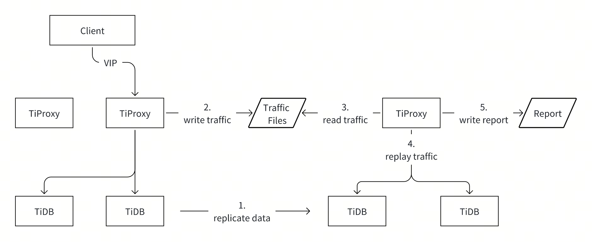
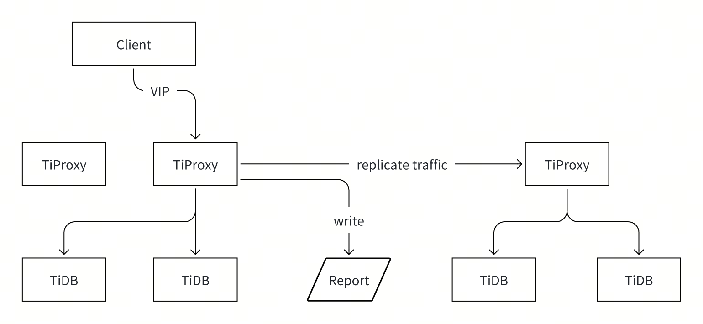

# Proposal: Traffic-Replay

- Author(s): [djshow832](https://github.com/djshow832)
- Tracking Issue: https://github.com/pingcap/tiproxy/issues/642

## Abstract

This proposes a design of capturing traffic on the production cluster and replaying the traffic on a testing cluster to verify the SQL compatibility and performance of the new cluster.

## Background

There are some cases when users want to capture the traffic on the production cluster and replay the traffic on a testing cluster:
- A new TiDB version may have compatibility breakers, such as the statements failing, running slower, or resulting in different query results.
- When the cluster runs unexpectedly, users want to capture the traffic so that they can investigate it later by replaying the traffic.
- Test the maximum throughput of a scaled-up or scaled-down cluster using the real production workload instead of standard bench tools.

Some traffic replay tools are widely used, including tcpcopy, mysql-replay, and query-playback. Mysql-replay relies on tcpdump and tcpcopy captures traffic like tcpdump, while query-playback is based on slow logs. Although some of them are built for MySQL, deploying them on the proxy instance also works.

However, they have some limitations:
- Hard to deploy and use. For example, the tools may sometimes fail to be compiled, or take too long to preprocess the captured traffic files.
- Tcpcopy only captures new connections, which is unfriendly for persistent connections. Mysql-replay can capture existing connections but it loses session states such as prepared statements and session variables, which may make replay fail.
- The tools replay the traffic within one schema, requiring huge modifications to the testing cluster.
- The tcpdump way doesn't record the result information or duration, while the slow log records the finish time of statements and breaks statement order.
- Tcpcopy and mysql-replay don't support TLS because they can't decode the encrypted data.
- Users need to verify the correctness and performance manually.

## Goals

- Verify the SQL compatibility, performance, and correctness of the new TiDB cluster and generate a report
- Capture the existing sessions even if they already have states like prepared statements
- Capture the traffic even if TLS and compression are enabled
- Provide friendly user interfaces to capture traffic, replay traffic, and check report
- Replay the traffic captured by mysql-replay to verify the compatibility of MySQL and TiDB

## Non-Goals

- Support capturing and replaying traffic on multiple active TiProxy instances
- Replicate the traffic to the new TiDB cluster online without storing the traffic
- Support capturing and replaying traffic on the TiDB Cloud

## Proposal

The basic procedure is:
1. The user creates a TiDB cluster with a new TiDB version.
2. (Optional) The user synchronizes data from the production TiDB cluster to the new cluster and then executes `ANALYZE` commands to refresh the statistics.
3. The user turns on traffic capture on the production TiDB cluster and TiProxy stores traffic to the specified directory. The username and password should be specified.
4. The user turns on traffic replay on the testing TiDB cluster and TiProxy replays traffic and generates a report.
5. The user checks the report to see if the result is expected.



### Traffic Capture

TiProxy stores these fields into traffic files:
- The start timestamp of this command.
- The TiProxy connection ID of this command.
- The binary format of this command.
- The first packet header, packet number, size, and duration of the response.

Most applications use persistent connections, so TiProxy should also capture existing connections. If the existing sessions are in transactions, TiProxy waits for the end of the transaction.

Existing sessions may have states like prepared statements. For these sessions, TiProxy queries the session states by `SHOW SESSION_STATES` and stores the states as `SET SESSION_STATES` statements in the traffic files.

`SHOW SESSION_STATES` shows all session variables, regardless of whether they have been set by the clients or not, which may miss some problems caused by changes of default session variable values. For example, a session variable has changed its default value in the new version, but TiProxy migrates the old value to the testing cluster to overwrite the default value and reports no errors. When the user migrates applications to the new version, he may find some compatibility breakers caused by the new default value.

### Traffic Storage

To support adding more fields in the future, the traffic file format is similar to slow logs:

```
# Time: 2024-01-19T16:29:48.141142Z
# Query_time: 0.01
# Conn_ID: 123
# Cmd_type: 3
# Rows_sent: 1
# Result_size: 100
# Payload_len: 8
SELECT 1
```

To replay the statements in the same order, the statements should be ordered by the start time. So the field `Time` indicates the start time instead of the end time. To order by the start time, one statement must stay in memory until all the previous statements are finished. If a statement runs too long, it's logged without query result information, so the replay skips checking the result and duration.

It's trivial to lose traffic during failure, so TiProxy doesn't need to flush the traffic synchronously. To reduce the effect on the production cluster, TiProxy flushes the traffic in batch asynchronously with double buffering. Similarly, TiProxy loads traffic with double buffering during replaying. If the IO is too slow and the buffer accumulates too much, the capture should stop immediately and the status should be reported in UI and Grafana.

The traffic files contain sensitive data, so TiProxy may need to encrypt the data.

To fully simulate the real workload, users may capture the traffic of days, so TiProxy also needs to compress data or store data on object storage systems.

### Traffic Replay

TiProxy replays traffic with the following steps:
1. Connect to TiDB using the specified username in the traffic file.
2. Replay the session states with `SET SESSION_STATES` statement in the traffic file.
3. Replay the commands one by one.

All the connections share the same username to replay. The user needs to create an account with full privilege and then specify the username and password on TiProxy.

Replaying DDL and DML statements makes the data on the testing cluster dirty, which requires another import if the replay needs to be executed again. To avoid this, TiProxy should support a statement filter, which allows read-only statements to be replayed. TiProxy may not parse the statement correctly because its version decouples with the TiDB version, so it normalizes the statement and simply searches for keywords such as `SELECT`, `UNION`, and `FOR UPDATE` to judge whether the statement is read-only.

When replaying commands, we support multiple speed options:
- Replay with the same speed as the production cluster. Since the command timestamps are recorded in the traffic files, TiProxy can replay with the same speed. It can simulate the production workload.
- Replay with a customized speed, such as 1.5x speed. It's used to get the maximum throughput of the new TiDB version, as well as keep the order of transactions.
- Replay as fast as possible. That is, send the next command once the previous query result is received. It can also get the maximum QPS and verify whether the execution is successful. It can't verify the correctness because it breaks transaction orders.

In case the response time exceeds the start time of the next command, TiProxy sends the next command immediately.

If the statement is too large, such as batch insert, reading the whole command at once takes too long and uses too much memory. TiProxy should read and send the commands streamingly.

### Verification and Report

TiProxy supports more kinds of comparison than existing tools:
- Compare the response packet header to verify whether the execution succeeds.
- Compare the response packet number to verify the returned row number.
- Compare the response size to verify the result set size. An alternative is to verify the checksum of the result set but it affects performance more.
- Compare the response time to verify performance degradation. The warning is reported only when degradation is too severe to avoid generating too many warnings.

Now that TiProxy has a fully privileged account to access TiDB on the testing cluster, it can store the report in TiDB tables. Showing in tables brings more advantages than storing it in files:
- Support complex operations such as filtering, aggregating, and ordering
- TiProxy can insert  a failed statement to the table and then update the execution count periodically to reduce memory usage

The above warning types are written into 4 tables respectively. The warnings should be grouped by the statement digest. The table definitions:

```sql
create table tiproxy_traffic_replay.summary(
    failed_count int,
    failed_stmt_types int,
    faster_stmt_count int,
    slower_stmt_count int,
    result_mismatches int);
    
# the statements that failed to run
create table tiproxy_traffic_replay.fails(
    digest varchar(128),
    sample_stmt text,
    sample_capture_time timestamp,
    sample_replay_time timestamp,
    count int,
    err_msg text,
    primary key(digest));
    
# the statements that are much slower
create table tiproxy_traffic_replay.slow(
    digest varchar(128),
    sample_stmt text,
    sample_capture_time timestamp,
    sample_replay_time timestamp,
    count int,
    ratio float,
    primary key(digest));
    
# the statements that results mismatch
create table tiproxy_traffic_replay.mismatch(
    digest varchar(128),
    sample_stmt text,
    sample_capture_time timestamp,
    sample_replay_time timestamp,
    count int,
    expected_rows int,
    actual_rows int,
    expected_size int,
    actual_size int,
    primary key(digest));
 ```

If the user only needs to verify the success of statement execution, he doesn't need to import data and TiProxy only needs to verify the packet header. Thus, the verification options should be configurable.

### User Interface

To capture traffic, one needs to turn it on and then turn it off or specify a duration.

It's not intuitive to update the configuration to turn it on and off. A better way is using SQL. Since TiProxy doesn't parse SQL, TiDB parses SQL and sends the command through TiProxy HTTP API.

The HTTP API is as follows:

```http
PUT /api/traffic/capture/start?output=/tmp/traffic.log&duration=1h&encryption=true
PUT /api/traffic/capture/stop
PUT /api/traffic/replay/start?username=u1&password=123456&input=/tmp/traffic.log&encryption=true
PUT /api/traffic/replay/stop
GET /api/traffic/jobs
```

The `jobs` shows:
- The current progress of the running catpure or replay job if the there's one running
- The last run time, final progress, and error message if a job has finished

To be compatible with lower versions, we also support using TiProxyCtl. The TiProxyCtl commands:

```shell
tiproxyctl traffic capture start --output="/tmp/traffic.log" --duration=1h encryption=true
tiproxyctl traffic capture stop
tiproxyctl traffic replay start --username="u1" --password="123456" --input="/tmp/traffic.log" --encryption=true
tiproxyctl traffic replay stop
tiproxyctl traffic jobs
```

The SQL statements:

```SQL
ADMIN TRAFFIC CAPTURE START OUTPUT="/tmp/traffic.log" DURATION="1h" ENCRYPTION=true
ADMIN TRAFFIC CAPTURE STOP
ADMIN TRAFFIC REPLAY START USERNAME="u1" PASSWORD="123456" INPUT="/tmp/traffic.log" ENCRYPTION=true
ADMIN TRAFFIC REPLAY STOP
ADMIN TRAFFIC JOBS
```

## Alternatives

### Replicate Traffic Online

It looks simpler to replicate traffic directly to a testing cluster:



It's less flexible than the offline mode:
- It's almost impossible to replay traffic when the production cluster behaves unexpectedly because the testing cluster is not ready.
- If the test result is unexpected and the replication needs to be scheduled again, the performance of the production cluster is affected again.

### Be Compatible with mysql-replay

In terms of the format of traffic files, TiProxy is better to be compatible with mysql-replay so that it's able to verify the compatibility of MySQL and TiDB, but the format of mysql-replay traffic files is not extensible and hard to be compatible with. It's more practicable for TiProxy to transform the tcpdump `pcap` files into its own format.

However, since the current schema and other session states are not recorded in the traffic files, TiProxy has the same limitation as other replay tools.

## Future works

### Provide GUI with TiDB Dashboard

Offering GUI on the TiDB Dashboard is more friendly than providing SQL. Dashboard can send HTTP requests to TiProxy directly so it doesn't require SQL. Besides, showing the report on GUI is more straightforward. 

However, the TiDB Dashboard is unavailable on the cloud, limiting the scope. We may support it later if self-managed users really want it.